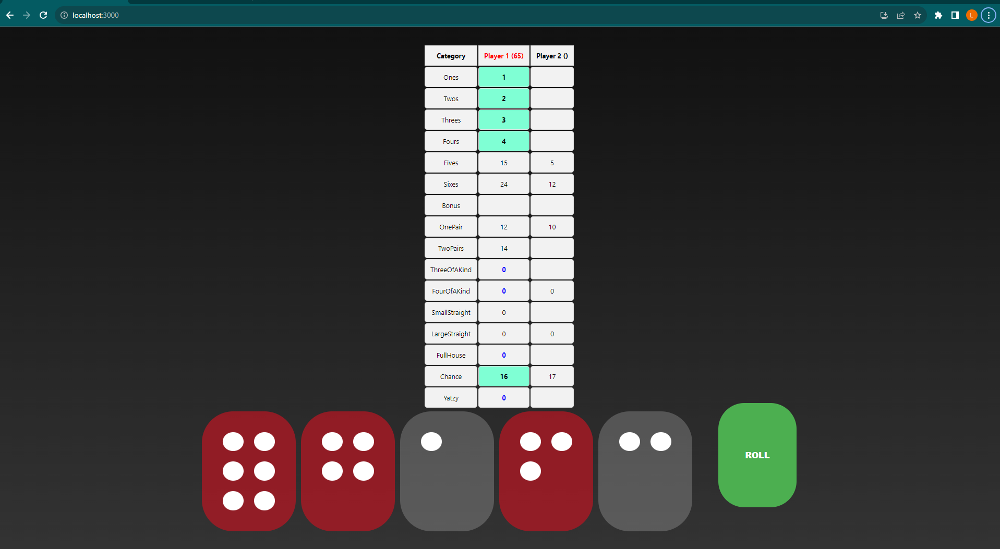

# Yatzlee
Spaghetti code frontend for a Yatzlee game.

Live at: [https://yatzy.badal.se](https://yatzy.badal.se)

## Screenshot

## TODO
- [] Mobile friendly

## Available Scripts

In the project directory, you can run:

### `npm start`

Runs the app in the development mode.\
Open [http://localhost:3000](http://localhost:3000) to view it in your browser.

The page will reload when you make changes.\
You may also see any lint errors in the console.

### `npm test`

### `npm run build`

### `npm run eject`

